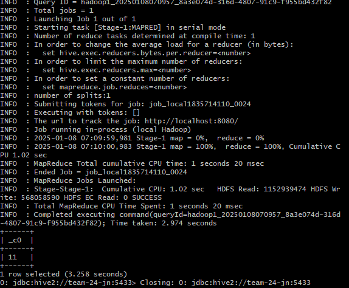

# Практическое задание №3. Apache Hive




*Рис.1 Результат выполнения запроса для подсчета строк в партиционированной таблице*

## Postgres

```
# Вход на сервер в jump node
ssh team@176.109.91.35

ssh team-24-nn # Перейдем на name node
sudo apt install postgresql
sudo -i -u postgres
psql

CREATE DATABASE metastore;
CREATE USER hive WITH PASSWORD 'password';
GRANT ALL PRIVILEGES ON DATABASE "metastore" TO hive;
ALTER DATABASE metastore OWNER TO hive;

\q

exit
```

```
sudo nano /etc/postgresql/16/main/postgresql.conf
listen_addresses = 'team-24-nn' # А конфиге укажем
```

```
sudo nano /etc/postgresql/16/main/pg_hba.conf

# В IPv4 local connections
Заменяем:
host all all 127.0.0.1/32 scram-sha-256, на
host metastore hive <jump node>/32 password
```

```
sudo systemctl restart postgresql
sudo systemctl status postgresql
```

```
# Установим клиент
sudo apt install postgresql-client-16
psql -h team-24-nn -p 5432 -U hive -W -d metastore 
```

```
ssh team-24-jn # Возвращаемся на jn (jump node)
```


## Hadoop

```
sudo -i -u hadoop1 # Переходим в jn в пользователя hadoop1

# После 1 ДЗ hadoop 3.4.0 предполагается что уже установлен

# Пути к нему так же добвлены в файле
nano ~/.profile

export HADOOP_HOME=/home/hadoop1/hadoop-3.4.0
export JAVA_HOME=/usr/lib/jvm/java-11-openjdk-amd64
export PATH=$PATH:$HADOOP_HOME/bin:$HADOOP_HOME/sbin

source ~/.profile
```

```
cd hadoop-3.4.0/etc/hadoop
nano core-site.xml

<configuration>
    <property>
        <name>fs.defaultFS</name>
        <value>hdfs://team-24-nn:9000</value>
    </property>
</configuration>
```

```
nano hdfs-site.xml

<configuration>
    <property>
        <name>dfs.replication</name>
        <value>3</value>
    </property>
</configuration>
```


## Hive. Установка

```
# Вход на сервер в jump node
ssh team@176.109.91.35

# Загружаем Apache Hive
wget https://dlcdn.apache.org/hive/hive-4.0.1/apache-hive-4.0.1-bin.tar.gz 
tar -xzvf apache-hive-4.0.1-bin.tar.gz 
cd apache-hive-4.0.1-bin
```

```
# Добивим исполняемые файлы в PATH
export HIVE_HOME=/home/hadoop1/apache-hive-4.0.1-bin 
export HIVE_CONF_DIR=$HIVE_HOME/conf
export HIVE_AUX_JARS_PATH=$HIVE_HOME/lib/*
export PATH=$PATH:$HIVE_HOME/bin
```


## Hive. Настройка

```
# Находимся в jn под hadoop1

cd ~
wget https://dlcdn.apache.org/hive/hive-4.0.1/apache-hive-4.0.1-bin.tar.gz
tar -xvzf apache-hive-4.0.1-bin.tar.gz
cd apache-hive-4.0.1-bin
cd lib
wget https://jdbc.postgresql.org/download/postgresql-42.7.4.jar
```

```
cd ../conf
nano hive-site.xml

<configuration>
   <property>
       <name>hive.server2.authentication</name>
       <value>NONE</value>
   </property>
   <property>
       <name>hive.metastore.warehouse.dir</name>
       <value>/user/hive/warehouse</value>
   </property>
   <property>
       <name>hive.server2.thrift.port</name>
       <value>5433</value>
   </property>
   <property>
       <name>javax.jdo.option.ConnectionURL</name>
       <value>jdbc:postgresql://team-24-nn:5432/metastore</value>
   </property>
   <property>
       <name>javax.jdo.option.ConnectionDriverName</name>
       <value>org.postgresql.Driver</value>
   </property>
   <property>
       <name>javax.jdo.option.ConnectionUserName</name>
       <value>hive</value>
   </property>
   <property>
       <name>javax.jdo.option.ConnectionPassword</name>
       <value>password</value>
   </property>
</configuration>
```

```
# Добавляем переменные окружения
nano ~/.profile

export HIVE_HOME=/home/hadoop1/apache-hive-4.0.1-bin
export HIVE_CONF_DIR=$HIVE_HOME/conf
export HIVE_AUX_JARS_PATH=$HIVE_HOME/lib/*
export PATH=$PATH:$HIVE_HOME/bin

# Сохраняем, выходим, применяем
source ~/.profile 
```

```
# Проверяем что все запущено
hive --version
hadoop version
```

```
# Создадим директорию
hdfs dfs -mkdir -p /user/hive/warehouse
hdfs dfs -chmod g+w /user/hive/warehouse
hdfs dfs -chmod g+w /tmp

cd ..
```

```
# Запустим Hive сервер
bin/schematool -dbType postgres -initSchema
hive --hiveconf hive.server2.enable.doAs=false --hiveconf hive.security.authorization.enabled=false --service hiveserver2 1>> /tmp/hs2.log 2>> /tmp/hs2.log &

jps
```


## Hive. Загрузка данных

```
# Находимся на jn под hadoop1
ssh team@176.109.91.35
sudo -i -u hadoop1

# Создадим тестовый .csv файл
nano real_estate_listings.csv

id;url;location;price;year_built;type;bedrooms;bathrooms;state;listing_date
0;https://realestate.example.com/listing-0;New York;500000;2000;apartment;2;1;NY;2024-01-01
1;https://realestate.example.com/listing-1;Los Angeles;750000;1995;house;3;2;CA;2024-01-02
2;https://realestate.example.com/listing-2;Chicago;650000;2010;apartment;2;1;IL;2024-01-03
3;https://realestate.example.com/listing-3;Houston;700000;2005;house;4;3;TX;2024-01-04
4;https://realestate.example.com/listing-4;Phoenix;550000;2015;apartment;2;1;AZ;2024-01-05
5;https://realestate.example.com/listing-5;Philadelphia;600000;2000;apartment;3;2;PA;2024-01-06
6;https://realestate.example.com/listing-6;San Antonio;620000;1998;house;4;3;TX;2024-01-07
7;https://realestate.example.com/listing-7;San Diego;720000;2018;house;5;4;CA;2024-01-08
8;https://realestate.example.com/listing-8;Dallas;680000;2003;apartment;2;1;TX;2024-01-09
9;https://realestate.example.com/listing-9;San Jose;800000;2020;house;4;3;CA;2024-01-10
```

```
hdfs dfs -mkdir /input
hdfs dfs -chmod g+w /input

hdfs dfs -rm /input/real_estate_listings.csv
hdfs dfs -put real_estate_listings.csv /input/

# Посмотрим на загруженные данные
hdfs dfs -cat /input/real_estate_listings.csv
hdfs fsck /input/real_estate_listings.csv
```

```
# Подключимся к серверу Hive через beeline
beeline -u jdbc:hive2://team-24-jn:5433
```

```
# Создадим БД
SHOW DATABASES;
DROP DATABASE estate_listings CASCADE;
CREATE DATABASE IF NOT EXISTS estate_listings;
```

```
# Создадим непартиционированную таблицу в Hive
USE estate_listings;
DROP TABLE IF EXISTS estate_listings.properties;

CREATE TABLE IF NOT EXISTS estate_listings.properties (
    id STRING,
    url STRING,
    location STRING,
    price STRING,
    year_built STRING,
    type STRING,
    bedrooms STRING,
    bathrooms STRING,
    state STRING,
    listing_date STRING
)
ROW FORMAT DELIMITED 
FIELDS TERMINATED BY ';';

LOAD DATA INPATH '/input/real_estate_listings.csv' 
INTO TABLE estate_listings.properties;
```

```
SET hive.exec.dynamic.partition=true;
```

```
# Создадим партиционированную таблицу
DROP TABLE IF EXISTS estate_listings.properties_partitioned;

CREATE TABLE IF NOT EXISTS estate_listings.properties_partitioned (
    id STRING,
    url STRING,
    location STRING,
    price STRING,
    year_built STRING,
    type STRING,
    bedrooms STRING,
    bathrooms STRING,
    state STRING
)
PARTITIONED BY (listing_date STRING)
ROW FORMAT DELIMITED
FIELDS TERMINATED BY ';';

INSERT OVERWRITE TABLE estate_listings.properties_partitioned
PARTITION(listing_date)
SELECT 
    id,
    url,
    location,
    price,
    year_built,
    type,
    bedrooms,
    bathrooms,
    state,
    listing_date
FROM estate_listings.properties;
```

```
SELECT COUNT(*) FROM estate_listings.properties_partitioned;
```
