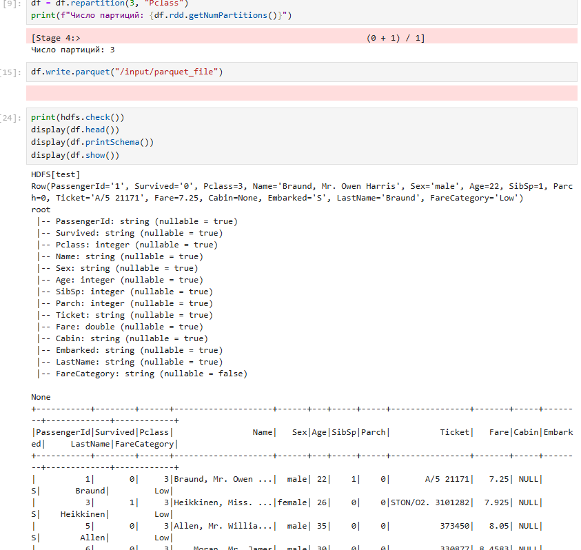

# Практическое задание №4. Apache Spark



*Рис.1 Загрузка и отображение данных из HDFS в PySpark с использованием DataFrame*

## Apache Spark

```
# Вход на сервер в jump node под hadoop1
ssh team@176.109.91.35
sudo -i -u hadoop1

wget https://dlcdn.apache.org/spark/spark-3.5.3/spark-3.5.3-bin-hadoop3.tgz
tar -xvzf spark-3.5.3-bin-hadoop3.tgz
```


```
# Добавляем переменные окружения в конфиг
nano ~/.profile

export HADOOP_CONF_DIR=$HADOOP_HOME/etc/hadoop
export SPARK_HOME=/home/hadoop1/spark-3.5.3-bin-hadoop3
export PATH=$PATH:$SPARK_HOME/bin

source ~/.profile
```


```
# Скачиваем данные
wget https://raw.githubusercontent.com/datasciencedojo/datasets/master/titanic.csv

# Создадим путь для хранения данных
hdfs dfs -mkdir /input
hdfs dfs -chmod g+w /input
hdfs dfs -put titanic.csv /input

hdfs dfs -cat /input/titanic.csv
```


```
source ~/.profile
hive
    --hiveconf hive.server2.enable.doAs=false
    --hiveconf hive.security.authorization.enabled=false
    --service metastore
    1>> /tmp/metastore.log
    2>> /tmp/metastore.log
```


```
# Вход на сервер в name node под hadoop1
ssh team@176.109.91.35
ssh team-24-nn
sudo -i -u hadoop1

cd ~
python3 -m venv .venv
source .venv/bin/activate
pip install pyspark
pip install onetl
pip install notebook

jupyter notebook --no-browser --port=9999 --ip=0.0.0.0
```


```
# В другом терминале на локальной машине
# Откроем туннель
ssh -L 9999:127.0.0.1:9999 team@176.109.91.35 -t ssh -L 9999:127.0.0.1:9999 192.168.1.99

http://localhost:9999/tree?token=<токен>
```


```
# В Jyputer создадим .ipynb
from pyspark.sql import SparkSession
from pyspark.sql import functions as F
from pyspark.sql.types import IntegerType, StringType, DoubleType
from onetl.file import FileDFReader
from onetl.connection import SparkHDFS
from onetl.file.format import CSV


spark = SparkSession.builder \
    .master("yarn") \
    .appName("spark-with-yarn") \
    .config("spark.sql.warehouse.dir", "/user/hive/warehouse") \
    .config("spark.hadoop.hive.metastore.uris", "thrift://192.168.1.99:9083") \
    .enableHiveSupport() \
    .getOrCreate()

hdfs = SparkHDFS(host="192.168.1.99", port=9000, spark=spark, cluster="test")

reader = FileDFReader(connection=hdfs, format=CSV(delimiter=",", header=True), source_path="/input")
df = reader.run(["titanic.csv"])

print(f"Число партиций: {df.rdd.getNumPartitions()}")

mean_age = df.select(F.round(F.avg(F.col("Age")))).first()[0]
df = df.na.fill({"Age": mean_age})
df = df.dropna(subset=["Survived", "Pclass"])

df = df.withColumn("Age", df["Age"].cast(IntegerType()))
df = df.withColumn("SibSp", df["SibSp"].cast(IntegerType()))
df = df.withColumn("Parch", df["Parch"].cast(IntegerType()))
df = df.withColumn("Fare", df["Fare"].cast(DoubleType()))
df = df.withColumn("Pclass", df["Pclass"].cast(IntegerType()))
df = df.withColumn("Sex", df["Sex"].cast(StringType()))
df = df.withColumn("Embarked", df["Embarked"].cast(StringType())) 
df = df.withColumn("LastName", F.split(F.col("Name"), ",").getItem(0))

df = df.withColumn("FareCategory", 
                   F.when(df["Fare"] < 10, "Low")
                    .when((df["Fare"] >= 10) & (df["Fare"] < 30), "Medium")
                    .otherwise("High"))

df = df.repartition(3, "Pclass")
print(f"Число партиций: {df.rdd.getNumPartitions()}")

df.write.parquet("/input/parquet")

spark.stop()
```
