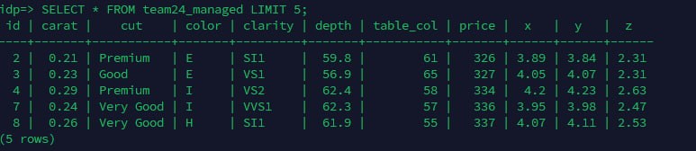

# Практическое задание №6. GreenPlum



*Рис.1 Результат выполнения запроса к таблице team24_managed в базе данных idp*


```
# Отдельный терминал 
ssh user@91.185.85.179
gpfdist --help
gpfdist -d /home/user -p 8080 &
```

```
ssh user@91.185.85.179
source /usr/local/greenplum-db/greenplum_path.sh

mkdir team-24-data
scp ../diamonds.csv user@91.185.85.179:~/team-24-data/
```

```
psql --version
psql -l
psql -d idp
```

```
CREATE EXTERNAL TABLE team24_ext (
    id INT,
    carat FLOAT,
    cut TEXT,
    color TEXT,
    clarity TEXT,
    depth FLOAT,
    table_col FLOAT,
    price INT,
    x FLOAT,
    y FLOAT,
    z FLOAT
)
LOCATION ('gpfdist://91.185.85.179:8080/team-24-data/diamonds.csv')
FORMAT 'CSV' (HEADER);
```

```
SELECT * FROM team24_ext LIMIT 5;
SELECT * FROM team24_ext WHERE cut = 'Premium' LIMIT 10;
```

```
CREATE TABLE team24_managed (
    id INT,
    carat FLOAT,
    cut TEXT,
    color TEXT,
    clarity TEXT,
    depth FLOAT,
    table_col FLOAT,
    price INT,
    x FLOAT,
    y FLOAT,
    z FLOAT
);
```

```
INSERT INTO team24_managed SELECT * FROM team24_ext;
```

```
idp=> SELECT * FROM team24_managed LIMIT 5;
```
